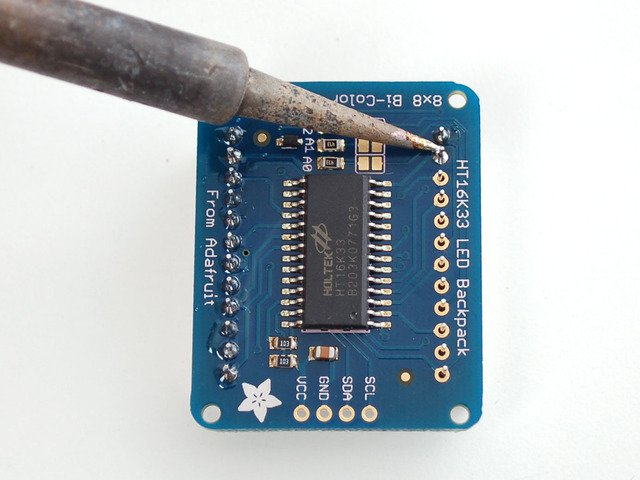

<h1> Bi-Color LED Matrix mit dem Arduino </h1>

<h3> Inhalt </h3>
<ul style="list-stlye-type:none">
<li><a href="#Einl">1. Einleitung</a></li>
<li><a href="#INBE">2. Inbetriebnahme des Arduino</a>
</li>
<li><a href="#MATR">3. Die LED-Matrix</a>
<ul> 
<li><a href="#AUFB">3.1 Aufbau </a></li>
<li><a href="#ZUSA">3.2 Zusammenbau </a></li>
<li><a href="#TEST">3.3 Test </a></li>
</ul> 
</li>
<li><a href="#PROG">4.Programme mit der Matrix</a>
<ul>
<li><a href="#51">4.1 Die Lichtorgel </a></li>
<li><a href="#52">4.2 Nachrichtenticker</a></li>
<li><a href="#53">4.3 Snake </a></li>
</ul>
</li>
</ul>

<h3 id="Einl">Einleitung </h3>

Der Arduino ist ein Microcontrollerboard, das auf dem ATmega328P basiert (<a href ="http://www.atmel.com/images/Atmel-8271-8-bit-AVR-Microcontroller-ATmega48A-48PA-88A-88PA-168A-168PA-328-328P_datasheet_Complete.pdf">Weitere Informartionen </a>) Er verfügt über 14 digitale Ein-/ bzw. Ausgänge, 6 analoge Eingänge, einen USB-Anschluss, einen Stromanschluss, einen 16 MHz Quartzkristall (zur Zeitbestimmung) und einen Reset-Knopf. Mit dem Arduino kann man LEDs, Motoren oder ähnliches anschließen und diverse Sensoren auslesen. Auch kleine LCD-Displays oder LED-Matrizen kann man ansteuren und Dinge auf ihnen anzeigen.<a href="#A1">[1]</a> Im Folgenden wird sich auf die 8x8 Bicolor LED Matrix von Adafruit bezogen, die man sich  <a href = "https://www.adafruit.com/product/902">hier </a> bestellen kann.<a href="#A2">[2]</a>

<h3 id="INBE">Inbetriebnahme des Arduino </h3>

Um den Arduino in Betrieb zu nehmen ist lediglich ein <a href = "https://img.conrad.de/medias/global/ce/9000_9999/9800/9860/9868/986899_LB_00_FB.EPS_1000.jpgUSB-A">USB-A auf USB-B </a> Kabel nötig, das mitgeliefert wurde. Um Programme für den Arduino zu schreiben und sie auf den Arduino zu überspielen, benötigt man die Arduino Software. Downloadlink: <a href = "https://www.arduino.cc/download_handler.php">Windows, </a> <a href = "https://www.arduino.cc/download_handler.php">Mac, </a> <a href = "https://www.arduino.cc/download_handler.php">Linux </a>

<h3 id="MATR">Die LED-Matrix </h3>

Die LED-Matrix besteht aus ingesamt 128 LEDs, von denen 64 rot und 64 grün sind. Sie können abwechselnd oder zusammen leuchten, sodass die Farben rot, grün und gelb/orange dargestellt werden können. Wie zu erkennen ist, verfügt die Matrix lediglich über 24 Pins, das heißt, dass auf einen Pin mehr als fünf LEDs entfallen. Um dennoch alle LEDs korrekt anzusteuern, kommt der Microcontroller ins Spiel. Mit einer Technik namens <a href = "https://de.wikipedia.org/wiki/Multiplexverfahren">Multiplexing </a> ist es möglich, mehrere Signale gebündelt zu übermittlen, um so die Übertragungsstrecke zu optimieren. Die Multiplexarbeit verrichten der Arduino und der Microcontroller, die als Sender und Empfänger die Signale erst bündeln und dann wieder aufspalten.

<h4 id="ZUSA">Zusammenbau </h4>
Damit alles korrekt funktioniert, ist es wichtig, dass Mircocontroller und Matrix korrekt zusammengelötet sind. Falls es das erste mal Löten sein sollte, ist hier ein kleines <a href = "http://mightyohm.com/files/soldercomic/translations/DE_SolderComic.pdf">Tutorial</a>.

 <h5>1.</h5> 
 

Man nimmt nun die Matrix zur Hand, und steckt sie auf den Microcontroller. <b> WICHTIG!!! </b> In einer Ecke ist statt einem Quadrat ein Kreis. Auf diese Seite muss die Seite der Matrix, auf die der Text steht (siehe Bild).

<h5>2.</h5>

Jetzt dreht man die Matrix mit dem Chip auf der Rückseite um und lötet alle 24 Pins fest. Anschließend knipst man die langen Enden ab um die Matrix nacher besser auf einem Breadboard platzieren zu könnnen. 

 <h5> 3. </h5> 

Anschließend lötet man das 4-Pin-Stück an die Platine. Damit das einfacher geht, steckt man diese Stück zuvor mit den <b> langen </b> Pins in ein Breadboard und platziert dann die Matrix darauf. Nun lötet man die vier Pins fest. 

