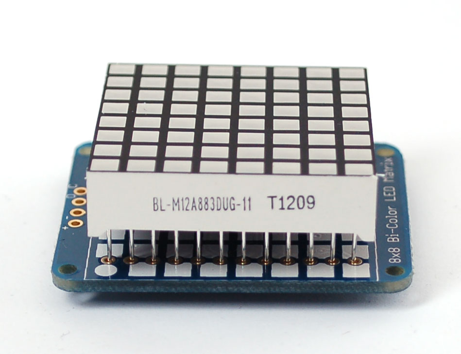

<h1> Bi-Color LED Matrix mit dem Arduino </h1>

<h3> Inhalt </h3>
<ul style="list-stlye-type:none">
<li><a href="#EINl">1. Einleitung</a></li>
<li><a href="#INBE">2. Inbetriebnahme des Arduino</a>
</li>
<li><a href="#MATR">3. Die LED-Matrix</a>
<ul> 
<li><a href="#ZUSA">3.1 Zusammenbau </a></li>
<li><a href="#TEST">3.2 Test </a></li>
</ul> 
</li>
<li><a href="#PROG">4.Programme mit der Matrix</a>
<ul>
<li><a href="#LICH">4.1 Die Lichtorgel </a></li>
<li><a href="#TEXT">4.2 Textdarstellung</a></li>
<li><a href="#SNAK">4.3 Snake </a></li>
</ul>
</li>
<li><a href="#ANHA">5. Anhang</a>
<ul>
<li><a href="#LIBR">5.1 Installieren von Libraries </a></li>
<li><a href="#SOUR">5.2 Quellen</a></li>
<li><a href="#CODE">5.3 Links zum Code </a></li>
</ul>
</li>
</ul>

<h3 id="EINL">Einleitung </h3>

Der Arduino ist ein Microcontrollerboard, das auf dem ATmega328P basiert (<a href ="http://www.atmel.com/images/Atmel-8271-8-bit-AVR-Microcontroller-ATmega48A-48PA-88A-88PA-168A-168PA-328-328P_datasheet_Complete.pdf">Weitere Informartionen </a>) Er verfügt über 14 digitale Ein-/ bzw. Ausgänge, 6 analoge Eingänge, einen USB-Anschluss, einen Stromanschluss, einen 16 MHz Quartzkristall (zur Zeitbestimmung) und einen Reset-Knopf. Mit dem Arduino kann man LEDs, Motoren oder ähnliches anschließen und diverse Sensoren auslesen. Auch kleine LCD-Displays oder LED-Matrizen kann man ansteuren und Dinge auf ihnen anzeigen.<a href="#A1">[1]</a> Im Folgenden wird sich auf die 8x8 Bicolor LED Matrix von Adafruit bezogen, die man sich  <a href = "https://www.adafruit.com/product/902">hier </a> bestellen kann.<a href="#A2">[2]</a>

<h3 id="INBE">Inbetriebnahme des Arduino </h3>

Um den Arduino in Betrieb zu nehmen ist lediglich ein <a href = "https://img.conrad.de/medias/global/ce/9000_9999/9800/9860/9868/986899_LB_00_FB.EPS_1000.jpgUSB-A">USB-A auf USB-B </a> Kabel nötig, das mitgeliefert wurde. Um Programme für den Arduino zu schreiben und sie auf den Arduino zu überspielen, benötigt man die Arduino Software. Downloadlink: <a href = "https://www.arduino.cc/download_handler.php">Windows, </a> <a href = "https://www.arduino.cc/download_handler.php">Mac, </a> <a href = "https://www.arduino.cc/download_handler.php">Linux </a> Für die Projekte sind lediglich Grundkentnisse des Arduinos erforderlich. 

<h3 id="MATR">Die LED-Matrix </h3>

Die LED-Matrix besteht aus ingesamt 128 LEDs, von denen 64 rot und 64 grün sind. Sie können abwechselnd oder zusammen leuchten, sodass die Farben rot, grün und gelb/orange dargestellt werden können. Wie zu erkennen ist, verfügt die Matrix lediglich über 24 Pins, das heißt, dass auf einen Pin mehr als fünf LEDs entfallen. Um dennoch alle LEDs korrekt anzusteuern, kommt der Microcontroller ins Spiel. Mit einer Technik namens <a href = "https://de.wikipedia.org/wiki/Multiplexverfahren">Multiplexing </a> ist es möglich, mehrere Signale gebündelt zu übermittlen, um so die Übertragungsstrecke zu optimieren. Die Multiplexarbeit verrichten der Arduino und der Microcontroller, die als Sender und Empfänger die Signale erst bündeln und dann wieder aufspalten.

<video src="images/multiplex.mp4" width="320" height="240" 
poster="images/multiplex.png" width="320" height="240" autobuffer 
controls>

Schade, hier wäre ein Video, doch leider unterstützt Ihr Browser kein HTML5. Chrome tut das: <a href = "https://www.google.com/intl/de/chrome/browser/desktop/index.html">Download</a>

</video>
<h4 id="ZUSA">Zusammenbau </h4>

Damit alles korrekt funktioniert, ist es wichtig, dass Mircocontroller und Matrix korrekt zusammengelötet sind. Falls es das erste mal Löten sein sollte, ist hier ein kleines <a href = "http://mightyohm.com/files/soldercomic/translations/DE_SolderComic.pdf">Tutorial</a>.

 <h5>1.</h5> 
 

Man nimmt nun die Matrix zur Hand, und steckt sie auf den Microcontroller. <b> WICHTIG!!! </b> In einer Ecke ist statt einem Quadrat ein Kreis. Auf diese Seite muss die Seite der Matrix, auf die der Text steht (siehe Bild).

<h5>2.</h5>

Jetzt dreht man die Matrix mit dem Chip auf der Rückseite um und lötet alle 24 Pins fest. Anschließend knipst man die langen Enden ab um die Matrix nacher besser auf einem Breadboard platzieren zu könnnen. 

 <h5> 3. </h5> 

Anschließend lötet man das 4-Pin-Stück an die Platine. Damit das einfacher geht, steckt man diese Stück zuvor mit den <b> langen </b> Pins in ein Breadboard und platziert dann die Matrix darauf. Nun lötet man die vier Pins fest. 

 <h5>4.</h5> 

Zuletzt muss die Matrix noch an den Arduino angeschlossen werden. Dafür benötigt man vier Jumper-Kabel, die man folgendermaßen verbindet:

<table>
<thead>
<tr>
<th>Oberseite Matrix</th>
<th align="center">Unterseite Matrix</th>
<th align="center">Pin am Arduino</th>
</tr>
</thead>
<tbody>
<tr>
<td>+</td>
<td align="center">VCC</td>
<td align="center">5V</td>
</tr>
<tr>
<td>-</td>
<td align="center">GND</td>
<td align="center">GND</td>
</tr>
<tr>
<td>D</td>
<td align="center">SDA</td>
<td align="center">A4</td>
</tr>
<tr>
<td>C</td>
<td align="center">SCL</td>
<td align="center">A5</td>
</tr>
</tbody>
</table>
<h4 id="TEST">Test </h4>

Jetzt kann man die Matrix testen: Hierzu einfach den Test-Code <a href = "https://github.com/OleMausS/LED-Matrix-Arduino/blob/master/code/Bicolor_Matrix_Test.ino">herunterladen</a> und ausführen. Die Matrix sollte nun den Text <i> Du hast es geschafft! </i> in grün, gelb und rot anzeigen. Anschließend wird ein grüner Smiley eingeblendet. 
<b>ACHTUNG!</b> Damit die Martix funktioniert, müssen zuerst die beiden Bibliotheken von Adafruit heruntergeladen werden: <a href = "https://github.com/adafruit/Adafruit-GFX-Library/archive/master.zip">Adafruit GFX </a> und <a href = "https://github.com/adafruit/Adafruit_LED_Backpack/archive/master.zip">Adafruit LED Backpack </a>. Wie man diese korrekt installiert, siehe <a href="#LIBR"> hier. </a>

<h3 id="PROG">Programme mit der Matrix </h3>

Die Matrix kann, wie bereits gesehen, alles mögliche Anzeigen. Damit das "Backpack" die Befehle richtig umsetzt, muss man zuerst die erforderlichen libraries importieren. Dies geschieht über der Befehl <code>#include "Name_der_Library.h</code>. In diesem Falle wären das  <i> Adafruit_GFX.h, Adafruit_LEDBackpack.h und Wire.h </i>. Danach trägt man ein um welches LED-Zubehör es sich handelt: <code>Adafruit_BicolorMatrix matrix = Adafruit_BicolorMatrix();</code>
Im Setup startet man den seriellen Monitor mit dem Befehl <code>Serial.begin(9600);</code>. Optional kann man noch einen Log einfügen, der den Programmstart makiert. Beispiel: <code>Serial.println("Programmstart");</code>. Ganz wichtig ist die Eingabe der IC2-Adresse, was mit dem Befehl <code>matrix.begin(0x70);</code> durchgeführt wird. Dabei ist die Adresse immer 0x70 für die erste Matrix die verbunden wurd, sind zwei verbunden, hat die erste die Adresse 0x70 und die zweite 0x71 und so fort. Ist alles richtig konfiguriert, kann es mit dem Programmieren losgehen. Ein fertiges Schema kann <a href="LED-Matrix-Arduino/code/Standard_Schema.ino">hier</a> heruntergeladen werden. 

<h4 id="LICH">Die Lichtorgel </h4>

Dies ist keine <a href="https://de.wikipedia.org/wiki/Lichtorgel"> Lichtorgel</a> im eigentlichen Sinne, sondern lediglich eine Darstellung von Lichtabläufen, Formen und Farben. Man kann jedoch mit verschiedenen Befehlen, viele Effekte darstellen. Um etwas auf der Matrix anzuzeigen verwentet man den Befehl <code>matrix.writeDisplay();</code> und um das was auf dem Bildschirm zu sehen ist zu entfernen, <code>matrix.clear();</code>. Wenn man die Matrix nicht "cleared", und erneut etwas "writed", dann wird es einfach auf das vorhandene projektiert. <b>ACHTUNG!</b> Führt man den Befehle <code>matrix.writeDisplay();</code> nicht aus, wird nichts auf der Matrix geändert!

<h5> Einzelne Pixel </h5>

Um einzelne Pixel zum Leuchten zu bringen, nutzt man den Befehl <code>matrix.drawPixel(x,y, LED_COLOR);</code>. X und Y ersetzt man dabei durch die entsprechenden Koordinaten. <b> ACHTUNG!</b> Die Koordianten beginnen bei (0;0) und enden bei (7;7). Um die Suche nach den richtigen Koordinaten zu vereinfachen, habe ich eine Übersicht (siehe Bild) hergestellt. COLOR steht für die Farbe, wobei die Werte YELLOW(für gelb/orange), GREEN(für grün) und RED(für rot) eingesetzt werden können. Alle <code>matrix.drawPixel(x,y, LED_COLOR);</code> Befehle, die vor einem <code>matrix.writeDisplay();</code> Befehl stehen, werden simultan ausgeführt, möchte man eine Pause einbauen, muss man den Befehl <code>delay(t in ms);</code> mit einbauen. Falls komplexere Formen dargestellt werden Sollen, sollte man auf <a href="#BITM">Bitmaps</a> zurückgreifen. 

 Beispiel für einen roten Punkt bei (1;4): <code>matrix.drawPixel(1,4, LED_RED);</code>

<h5> Linien </h5>

Linien werden ähnlich wie Pixel programmiert. Ihr Befehl lautet <code>matrix.drawLine(x1,y1, x2,y2, LED_COLOR);</code>. Die Koordinaten (x1;y1) geben dabei den Startpunkt und (x2;y2) den Endpunkt der Linie an. So können die Linien beliebig lang und ausgerichtet sein. COLOR gibt wieder die Farbe (YELLOW,GREEN, oder RED) an. Alle Linien, die vor einem <code>matrix.writeDisplay();</code> Befehl stehen, werden parallel eingeblendet. Baut man kleine Pausen mit ein, kann man einen Übergang etc. bauen. 

Beispiel für eine Grüne Linie von (0;1) bis (7;1):<code>matrix.drawLine(0,1, 7,1, LED_GREEN);</code>

<h5> Rechtecke </h5>

Es gibt zwei Arten von Rechtecken: Gefüllte und Leere. 
Die Gefüllten können mit dem Befehl matrix.fillRect(x;y, l,b, LED_COLOR) dargestellt werden. X und Y stehen für den Startpunkt des Rechtecks, d. h. ab diesem Punkt breiten sich die Kanten in x und y-Richtung aus. L und B stehen für Länge und Breite des Rechtecks. Möchte man ein Quadrat anzeigen, müssen beide Werte gleich groß sein. COLOR steht wieder für die Farben (YELLOW,GREEN, oder RED). In dem man mehrere Befehle für Rechtecke vor einen <code>matrix.writeDisplay();</code> Befehl schreibt, kann man mehrere Rechtecke gleichzeitig einblenden.

 Beispiel für ein gelbes Rechteck, 5 lang und 6 breit ausgehend vom Punkt (1;1): <code>matrix.fillRect(1,1, 5,6, LED_YELLOW);</code>
 

Leere Rechtecke funktionieren nach dem gleichen Prinzip, nur das sie innen hohl sind. Ihr Befehl lautet <code>matrix.drawRect(x,y, l,b, LED_COLOR);</code> X und Y stehen für den Startpunkt des Rechtecks, d. h. ab diesem Punkt breiten sich die Kanten in x und y-Richtung aus. L und B stehen für Länge und Breite des Rechtecks. Möchte man ein Quadrat anzeigen, müssen beide Werte gleich groß sein. COLOR steht wieder für die Farben (YELLOW,GREEN, oder RED). Auch hier kann man mehrere Rechtecke kombinieren.

Beispiel für 4 Leere und 4 gefüllte Rechtecke ineinander, jeweils farbverschoben:

<pre><code>matrix.drawRect(0,0, 4,4, LED_GREEN);
matrix.drawRect(0,0, 4,4, LED_GREEN);
matrix.drawRect(0,4, 4,4, LED_RED);
matrix.drawRect(4,4, 4,4, LED_GREEN);
matrix.drawRect(4,0, 4,4, LED_RED);
matrix.fillRect(5,1, 2,2, LED_GREEN);
matrix.fillRect(1,1, 2,2, LED_RED);
matrix.fillRect(1,5, 2,2, LED_GREEN);
matrix.fillRect(5,5, 2,2, LED_RED);</code></pre>

<h5> Kreise </h5>

Kreise verhalten sich ähnlich wie Rechtecke: Es gibt leere und gefüllte. Um sie zu positionieren gibt man den Mittelpunkt und den Radius an. Der Befehl für einen Kreis ohne Füllung lautet also <code>matrix.drawCircle(x,y, r, LED_COLOR);</code>. Die Koordinate (x;y)gibt den Mittelpunkt an und <code>r</code> den Radius. COLOR wie immer die Farbe. Genauso verhält es sich bei den gefüllten Kreisen, deren Befehl lautet <code>matrix.fillCircle(x,y, r, LED_COLOR);</code>. Aus der Breite der Matrix resuliert der maximal darstellbare Radius von 3, alles größere ist außerhalb der Matrix. (Mittelpunkt 1 + Radius 3 x 2 =7) 

 Beispiel: Ein Kreis mit einem Radius von 3, ausgehend von (3;3) in rot, darin ein ausgefüllter, gelber Kreis mit einem Radius von 2, auch ausgehend von (3;3) und darin wieder ein grüner, ausgefüllter Kreis, ebenfalls ausgehend von (3;3) mit einem Radius von 1.

<pre><code>matrix.drawCircle(3,3, 3, LED_RED);
matrix.fillCircle(3,3, 2, LED_YELLOW);
matrix.fillCircle(3,3, 1, LED_GREEN);</code></pre>
<h5 id="BITM">Bitmaps </h5>

Bitmaps stellen eine Möglichkeit dar, andere Formen darzustellen als Linien, Rechtecke oder Kreise. Man konfiguriert im <code>Setup</code> die Karte der Matrix so, dass man sie nacher beliebig oft und in allen drei Farben darstellen kann.

Um die Bitmaps zu initialisieren, fügt man unter die geschweifte Klammer des Setups die Zeile <code>static const uint8_t PROGMEM</code> ein. Darunter dann der Name der Bitmap in folgender Form: <code>bitmap_name[] =</code>. Die Nächste Zeile öffnet man dann mit einer geschweiften Klammer, und einem Leerzeichen ein B mit "01010101" dahinter am Ende ein Komma. Die 0 steht für einen ausgeschalteten Pixel und die 1 für einen eingeschalteten Pixel <code>{ B01010101,</code> in der nächsten Zeile dann ohne geschweifte Klammer <code> B10101010,</code> usw. bis zur 8. Zeile, die mit einer geschweiften Klammer und einem Semikolon endet <code> B01010101 };</code>. Möchte man nun anstatt der einen Bitmap zwei oder mehrere konfigurieren, beendet man die 8. Zeile mit einem Koma statt des Semikolons und benennt die nächste Bitmap usw. 

<pre><code> B01010101 },
bitmap_name2[] =
{ B10101010,</code></pre>
<b>ACHTUNG!</b> Nach der letzten geschweiften Klammer aller Bitmaps muss <u>immer</u> ein Semikolon folgen!

Beispiel:

<pre><code>static const uint8_t PROGMEM
  bitmap1[] =
  { B01010101,
    B10101010,
    B01010101,
    B10101010,
    B01010101,
    B10101010,
    B01010101,
    B10101010 },
  bitmap2[] =
  { B10101010,
    B01010101,
    B10101010,
    B01010101,
    B10101010,
    B01010101,
    B10101010,
    B01010101 };</code></pre>

Um die Bitmap anzuzeigen, betötigt man den Befehl: <code>matrix.drawBitmap(x,y, bitmap_name, l,b, LED_COLOR);</code>. X und Y geben die Ausgangspunkte der Bitmap an, im Normalfall ist das (0;0), falls man die Bitmap verschieben möchte, kann man die Koordinate variieren. L und B geben die Maße der Matrix an, in diesem Falle 8,8,. COLOR ist wieder eine der Farben YELLOW, RED oder GREEN.

<b>Tipp:</b>Es empfiehlt sich vor jedem Abbild einer Bitmap die Matrix zu "clearen".

<pre>Beispiel:
<code>matrix.drawBitmap(0,0, bitmap1, 8,8, LED_RED);
matrix.drawBitmap(0,0, bitmat2, 8,8, LED_GREEN);</code></pre>
<h5> Drehen des Displays </h5> <
Mit dem Befehl <code>matrix.setRotation(x);</code> kann man die Ausrichtung der Matrix bestimmen. Dabei entspricht 0 der Ausgangsposition, 1 einer 90° Drehung, 2 einer 180° Drehung, 3 einer 270° Drehung, während 4 wieder der Ausgangsposition entspricht. Diese Abfolge lässt sich beliebig lange fortsetzen, so dass sich unter Einsatz eines Counters das Display stetig weiterdreht. 
<h5> Abschließend zur Lichtorgel </h5>

Alle gezeigten Beispiele lassen sich beliebig kombinieren, der Kreativität sind keine Grenzen gesetzt. Unter Berücksichtung aller Beispiele habe ich ein Lichtabfolge geschrieben, in der man sich die einzelnen Elmente beispielhaft im Code ansehen kann: <a href="https://github.com/OleMausS/LED-Matrix-Arduino/blob/master/code/LichtorgelMatrix.ino">Download</a> 

<video src="images/lichtorgel.mp4" width="320" height="240" 
poster="images/lichtorgel.png" width="320" height="240" autobuffer 
controls>

Schade, hier wäre ein Video, doch leider unterstützt Ihr Browser kein HTML5. Chrome tut das: <a href = "https://www.google.com/intl/de/chrome/browser/desktop/index.html">Download</a>

</video>

<h4 id="TEXT">Textdarstellung</h4>

Es ist möglich auch ohne das vorherige Definieren von Bitmaps für jedes einzelne Zeichen. Mit dem Befehl <code>matrix.print("Text");</code> lässt sich ganz einfach Text darstellen. Jedoch reicht dieser Befehl alleine nicht aus.  Zuvor muss mit <code>matrix.setTextColor(LED_COLOR)</code> die Farbe festgelegt werden.<b> ACHTUNG</b> Mit dem Befehl können lediglich einzelne Zeichen dargestellt werden. 

<h5>Text bewegen </h5>

Um Zeichenfolgen darzustellen, müssen sich die Zeichen bewegen. Zuerst muss man definieren von wo nach wo sich der Text bewegen soll. Es bietet sich an, ihn in x-Richtung zu bewegen, um eine Art Newsticker zu imitieren. Mit <code>for (int8_t x=x1; x>=x2; x--){</code> setzt man die Start- und Endpunkte, in dem man die x-Koordinate variert. die  Um den Text vom rechten Rand einzubleben, muss x1 größer 7 sein, soll der Text ganz nach links aus dem Display bewegen, muss x1 größer sein als alle Breiten der einzelnen Zeichen addirt. Beispiel "Test": pro Buchstabe 5 Pixel und pro Leerzeichen 1 Pixel ergibt in der Summe 23. Man muss also mindestens -23 für x2 eitragen damit der Text nach links die Matrix verlässt.

Nach die Start-x-Koordnate definiert ist braucht man nun einen Cursor, der definiert von wo ausgehend der Text dargestellt werden soll.
Mit <code>matrix.setCursor(x,y);</code> lässt man den Text ab dem Punkt(x,y) in x und y Richtung erscheinen. Gibt man für y=0 an und lässt x als Variable, so wird sie mit jededem Durchgang des Loops um einen kleiner (durch x<b>--</b>) wodurch der Cursor und somit letzendlich auch der Text verschoben wird. Kehrt man alls um, so kann man den Text auch von links nach rechts laufen lassen (<code>for (int8_t x=x1; x<=x2; x++){</code> 

<b>ACHTUNG!</b> Damit der Text sich bewegt und dabei lesbar ist, muss nach jedem Durchlauf eine Pause einbaut werden. Es empfehlen sich 75-125ms). Des weiteren muss die Matrix nach jedem Durchlauf gesäubert werden, da sonst alles kumultativ dargestellt werden. Ebenfalls essentiell ist <code>matrix.setTextWrap(false);</code>, damit keine Zeilenumbrüche erstellen und so jeder Buchstabe einzeln und nicht aneinandergereiht erscheint.

<video src="images/textwtodelay.mp4" width="320" height="240" 
poster="images/textwtodelay.png" width="320" height="240" autobuffer 
controls>

Schade, hier wäre ein Video, doch leider unterstützt Ihr Browser kein HTML5. Chrome tut das: <a href = "https://www.google.com/intl/de/chrome/browser/desktop/index.html">Download</a>

</video>
<video src="images/scrolltext.mp4" width="320" height="240" 
poster="images/scrolltext.png" width="320" height="240" autobuffer 
controls>

Schade, hier wäre ein Video, doch leider unterstützt Ihr Browser kein HTML5. Chrome tut das: <a href = "https://www.google.com/intl/de/chrome/browser/desktop/index.html">Download</a>

</video>

Beispiel: 
<pre><code>matrix.setTextWrap(false);
matrix.setTextColor(LED_GREEN);
for (int8_t x=7; x>=-23; x--){ 
    matrix.clear();
    matrix.setCursor(x,0);
    matrix.print("Test");
    matrix.writeDisplay();
    delay(75);
  }</code></pre>

Man kann mit dem Befehl <code>matrix.setTextSize(x);</code> die Größe des Texts anpassen, wobei x die Breite der Schrift in Pixeln angibt. Alles größer als 1 lässt sich nicht auf einem 8x8 Display nicht darstellen. Weshalb der Befehl bei dieser Matrix unnütz ist.

<h4>Abschließend zur Textdarstellung</h4> 

Ein Beispiel für die Textdarstellung habe ich <a href="/code/LichtorgelMatrix.ino">hier</a> zusammengestellt, worin man sich die Einzelnen Befehle noch mal im Sketch ansehen kann.

<video src="images/textdisplay.mp4" width="320" height="240" 
poster="images/textdiplay.png" width="320" height="240" autobuffer 
controls>

Schade, hier wäre ein Video, doch leider unterstützt Ihr Browser kein HTML5. Chrome tut das: <a href = "https://www.google.com/intl/de/chrome/browser/desktop/index.html">Download</a>

</video>

<h4 id="SNAK">Snake-Game </h4>

Um das Spiel Snake auf der Matrix zu spielen, benötigt man eine Eingabequelle. Hier bietet sich ein Keypad an, welches auch käuflich <a href = "http://www.ebay.de/itm/4x4-Matrix-Array-16-Key-Membrane-Keypad-Keyboard-AVR-12V-Arduino/172404278496?_trksid=p2141725.c100338.m3726&_trkparms=aid%3D222007%26algo%3DSIC.MBE%26ao%3D1%26asc%3D20150313114020%26meid%3Dfcf3d60c3a6c4b71b83eebdfff634e71%26pid%3D100338%26rk%3D1%26rkt%3D16%26sd%3D272483052698"> erworben </a> werden kann.<a href="#A2">[2]</a>.

<h5>Keypad</h5>

Damit alle Funktionen des Keypads genutzt werden können, muss die Keypad Library geladen und <a href =#LIBR>installiert </a> werden. Um das Keypad korrekt einzusetzen musst es erst definiert werden. Dies funktioniert wie folgt: 

<pre><code>#include "Keypad.h"
const byte ROWS = 4; //das Keypad hat vier Reihen
const byte COLS = 4; //das Keypad hat vier Spalten
//definieren der Keymap, bzw. welcher Key auf welchem Feld liegt
char keys[ROWS][COLS] = { 
  {'1','2','3','A'},
  {'4','5','6','B'},
  {'7','8','9','C'},
  {'*','0','#','D'}
};
byte rowPins[ROWS] = {5, 4, 3, 2}; //definieren an Welchen Pins die Reihen liegen
byte colPins[COLS] = {9, 8, 7, 6}; //definieren an Welchen Pins die Spalten liegen

Keypad keypad = Keypad( makeKeymap(keys), rowPins, colPins, ROWS, COLS );</code></pre>

 
Mit dem Befehl <code>keypad.getKey();</code> kann man den aktuellen Key auslesen, wenn kein Key gedrückt wird ist Key = <code>NO_KEY</code>. Ein kleines Beispiel für die Kombination aus Matrix und Keypad gibt es <a href ="code/KeypadSample.ino">hier<a/>.

